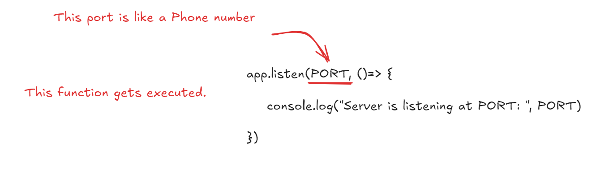
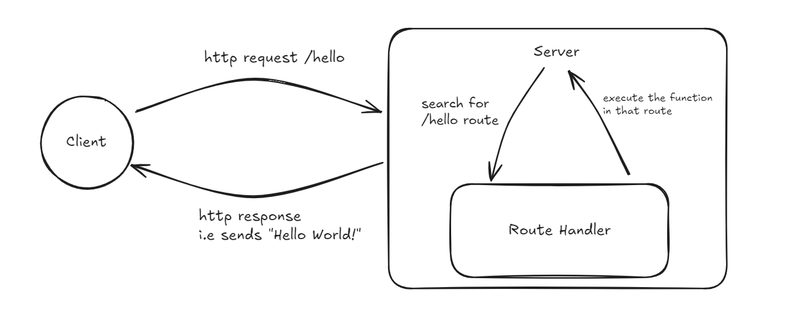
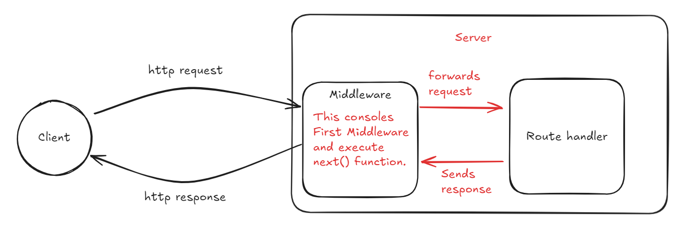

# 2. Introduction to Express.js

---

Express.js is a Node.js framework that provides the set of tools and features to build the servers and APIs quickly and easily. It simplifies the server-side development by providing following features:

- Routing Mechanism
- Middleware support
- HTTP request and response handling and so on.

#### 🎯 Creating our First Server using Express

---

First, we need to make sure we are inside our **Backend** folder. Then we need to install **express**. For that we need to head towards our terminal and use this command:
`npm install express`

My Folder structure is like this:


Then, we click on our entry file `server.js` . And start building our simple server.

```js
// Importing the Express framework so we can use it
import express from "express";

// Creating an instance of an Express application (our web server)
const app = express();

// Defining the port number where the server will "listen" for requests
const PORT = 3000;

app.listen(PORT, () => {
  console.log("Server is listening at PORT: ", PORT);
});
```

Let me explain what is happening at last line of code:


We are using `app.listen()` method from **express** which takes two arguments: one is PORT number and another is function. This basically tells that: "_We are open at port 3000, any request at 3000 port will get served by us."_

🎉 Congratulations! We have created our server using **Express.js**.

#### 📚 HTTP Methods

---

**HTTP Methods** (also known as **HTTP verbs**) are the type of operations a client wants to perform on the data stored on the server.

The most common HTTP Methods are listed below:

- **GET:** used to read or retrieve data from the server
- **POST:** used to create new data
- **PUT:** used to update the **entire** existing data
- **PATCH:** used to update **part** of existing data
- **DELETE:** used to delete existing data

#### 📚 HTTP Messages

---

The **HTTP Message** is the format of communication between client and server.
There are two main types:

1. **HTTP Request Message**: Sent by Client
2. **HTTP Response Message**: Sent by Server

#### 📚 HTTP Status Code

---

Let me directly jump to important status code that might be used most commonly in out project:

- `200 OK` for normal responses
- `201 Created` after successful POST
- `400 Bad Request` for invalid input
- `404 Not Found` when something doesn’t exist
- `500 Internal Server Error` for unexpected crashes

_Tip: Ensure to use `res.status(code).json(...)` for consistency in APIs._

#### 🎯 Creating our first Route

---

Let's create our first route to handle **GET** request from the used and send them "_Hello world_!" as a response.

```js
import express from "express";

const app = express();
const PORT = 3000;

// This defines a route for handling GET requests to /hello
app.get("/hello", (req, res) => {
  res.status(200).send("Hello world!");
});

app.listen(PORT, () => {
  console.log(`Server is listening at port ${PORT}`);
});
```

**How it works?** To understand this we need to learn about **Request/Response Cycle**.

#### 🌐 What is the Request/Response Cycle?

---

The **Request/Response Cycle** is the process that happens when a client (like our browser) sends a request to a **server**, and the server processes it and sends back a **response**.

***In above code,** when a we type http://localhost:3000/hello in our browser address bar and hit enter then the **server** finds the **/hello** route and execute the function in that route.*



Here comes the concept of **middleware**. **Middleware** is a function that runs **between** the request and the response. It can be used for various reasons:

- Log information
- Authenticate users
- Block or modify requests and so on.

```js
import express from "express";

const app = express();
const PORT = 3000;

// Middleware
app.use((req, res, next) => {
  console.log(`First Midleware`);
  next(); // Go to next middleware or route
});

// Route
app.get("/hello", (req, res) => {
  res.status(200).send("Hello world!");
});

app.listen(PORT, () => {
  console.log(`Server is listening at port ${PORT}`);
});
```

Here, each of the request have to go through the **middleware.**




There are some of the important middleware we need to use. Some of them are:

- `express.json`: Converts the **raw JSON** body into a usable JavaScript object under **req.body**
- `cors`: Allows or blocks **cross-origin** requests (used in APIs).
- `morgan`: Logs incoming HTTP requests, useful for monitoring and debugging

To use these middleware, first we need to install them using following commands:
`npm install cors morgan`

Then we need to add these line in our **server.js**:

```js
import express from "express";
import morgan from "morgan"; // import morgan
import cors from "cors"; // import cors

const app = express();
const PORT = 3000;

app.use(express.json()); // parse json and it into req.body
app.use(morgan("dev")); // use morgan for development mode
app.use(cors()); // use cors for all origin

// Route
app.get("/hello", (req, res) => {
  res.status(200).send("Hello world!");
});

app.listen(PORT, () => {
  console.log(`Server is listening at port ${PORT}`);
});
```
