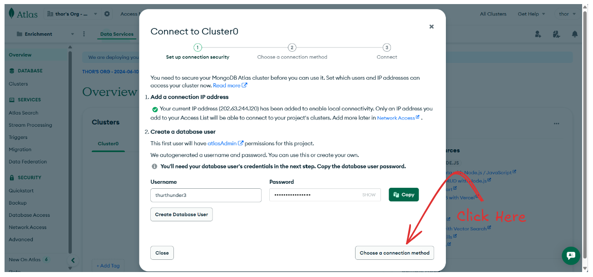
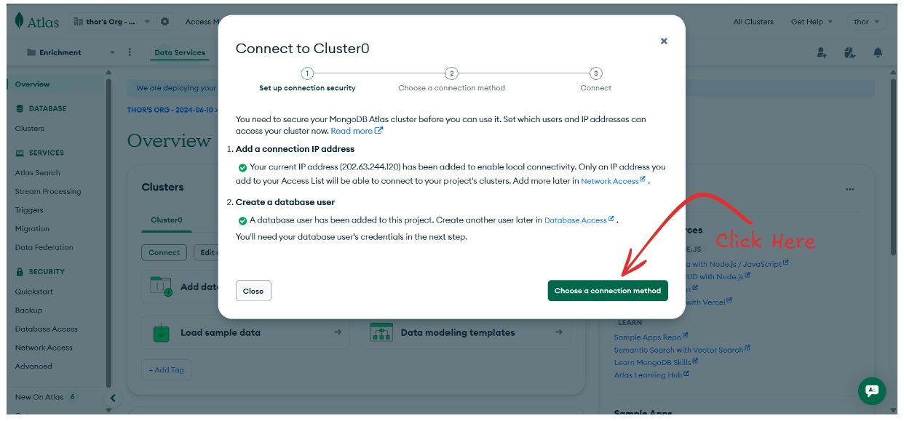
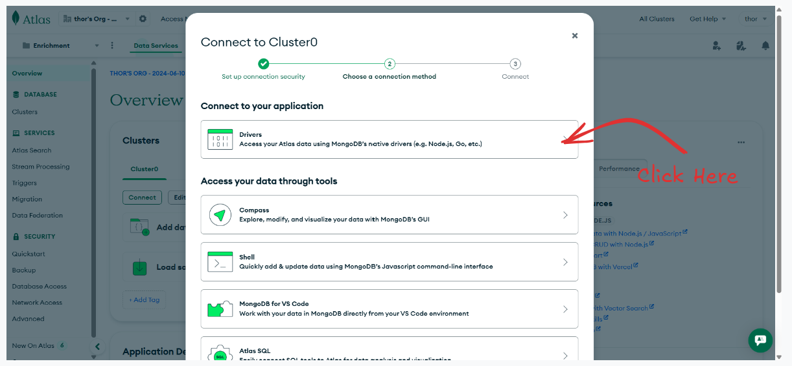

# 3. Database Connection

MongoDB is a **NoSQL database** that stores data in **flexible, JSON-like documents** called BSON. It works well with JavaScript and is widely used in Node.js projects.

#### 🛠️ Tools We will be Using

- **MongoDB Atlas** (cloud-based MongoDB)
- **Mongoose** – A library for easier schema & querying
- **dotenv** – To hide database credentials

### 1. Setup MongoDB atlas

---

- Go to: https://www.mongodb.com/cloud/atlas
- Sign in using Gmail
- **Create a free cluster**
- Create a **user and password**.
- - Add your **IP address** (0.0.0.0).
- Copy your **Connection URI** like this:

```url
mongodb+srv://<username>:<password>@cluster0.mongodb.net/<dbname>?retryWrites=true&w=majority
```

**Follow these images for setup:**


Now Click on `Free` tier and click on `Create Deployment`. Then this screen will appear








**Make sure to save this copied URL somewhere as we need that in later phase.**


### 2. Install Dependencies

---

```bash
npm install mongoose dotenv
```

### 3. Create a .env file in the root of Backend Folder

---

Inside `.env` file we need to place out MongoDB connection URL:

```bash
MONGO_URL = mongodb+srv://thurthunder3:<db_password>@cluster0.vd61jqe.mongodb.net/?retryWrites=true&w=majority&appName=Cluster0

PORT=3000
```

**Why Use a `.env` File?**
The one of the major reason is **Security**. We never want to expose sensitive information like **database URL** which consist of our username and password. If we hard-code this in our codebase (like in `server.js`), and push it to GitHub, **our credentials can be exposed**. `.env` is **not pushed to GitHub** if `.gitignore` is set properly.

### 4. Code to Connect MongoDB

---

In `server.js`, we need to write this code:

First import **mongoose and dotenv**:

```js
import express from "express";
import morgan from "morgan"; // import morgan
import cors from "cors"; // import cors
import mongoose from "mongoose"; // import mongoose for database connection
import dotenv from "dotenv"; // importing dotenv
dotenv.config();

const app = express();
const PORT = 3000;

app.use(express.json()); // parse json and it into req.body
app.use(morgan("dev")); // use morgan middleware for development mode
app.use(cors()); // use cors for all origin

// Route
app.get("/hello", (req, res) => {
  res.status(200).send("Hello world!");
});

app.listen(PORT, () => {
  console.log(`Server is listening at port ${PORT}`);
});
```

Now, lets connect the database:

```js
import express from "express";
import morgan from "morgan"; // import morgan
import cors from "cors"; // import cors
import mongoose from "mongoose";
import dotenv from "dotenv";
dotenv.config();

const app = express();
const PORT = process.env.PORT || 3000;

app.use(express.json());
app.use(morgan("dev"));
app.use(cors());

// Route
app.get("/hello", (req, res) => {
  res.status(200).send("Hello world!");
});

// DB Connection
mongoose
  .connect(process.env.MONGO_URL) // MONGO_URL name should be same as that in .env
  .then(() => {
    console.log("Database Connected!");
  })
  .catch((err) => {
    console.error("Mongodb Error: ", err);
  });

app.listen(PORT, () => {
  console.log(`Server is listening at port ${PORT}`);
});
```

### Common Mongoose Database Methods

---

Let's learn about some of the common methods to **create, read, update and delete.** Assume we have model named as `EmployeeModel`.

##### 1. Create new document

```js
await EmployeeModel.create(object);
```

Adds new employee to the `employee` collection.

##### 2. Find all the employees

```js
const employees = await EmployeeModel.find();
```

Fetches all records in the collection.

##### 3. Find One Employee by Email

```js
const employees = await EmployeeModel.findOne({
  email: "sagarchhetry333@gmail.com",
});
```

Returns the first employee that matches the condition.

##### 4. Find Employee by Id

```js
const employee = await EmployeeModel.findById(id);
```

Searches the employee using document's `_id`.

##### 5. Update the Employee by ID

```js
const updated = await EmployeeModel.findByIdAndUpdate(
  id,
  { salary: 160000 },
  { new: true }
);
```

Updated the employee based on Id and then return the updated document.

##### 6. Delete an Employee

```js
await EmployeeModel.findByIdAndDelete(id);
```

Removes the employee with the given ID.

##### 7. Sorting

```js
const topPaid = await EmployeeModel.find().sort({ salary: -1 });
```

Return the employees with highest Salary `(-1 means descending order)`

##### 8. Limit

```js
const topPaid = await EmployeeModel.find().sort({ salary: -1 }).limit(3);
```

Returns top 3 employees with the highest salary.
