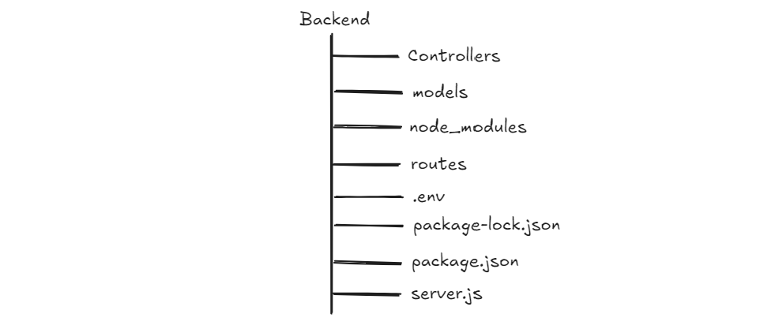

# 4. Understanding MVC and MVCR in Express.js

**MVC** stands for **Model View Controller**. It is design pattern that helps to **separate concerns** for better maintainability and readability.

- **Model:** Handles the **data, schema** and **validation**
- **View:** Displays the **data**
- **Controller:** Handles the **logic** and **communication** between model and view

The common extension of **MVC** is **MVCR**, especially in Express.js apps. IN **MVCR**, **R** stands for **Router**. This adds additional **Router** layer to separate routing logics.

We need to create following folders: **models, routes, controllers**. The folder structure looks like this:


#### 1. Creating Models for Employees

---

Let's create a model for employee with necessary fields. To create a model we need to follow following steps:

- Create a file names as `employee.model.js` inside `model` folder:

  

- Now inside that file, first we need to import the mongoose

```js
import mongoose from "mongoose";
```

- Then we need to make a schema for Employee

```js
import mongoose from "mongoose";

const employeeSchema = new mongoose.Schema({
  name: {
    required: true,
    type: String,
    trim: true,
  },
  email: {
    type: String,
    trim: true,
    unique: true,
    lowercase: true,
  },
  designation: {
    type: String,
    required: true,
  },
  department: {
    type: String,
    required: true,
  },
  userType: {
    type: String,
    required: true,
  },
  salary: {
    type: Number,
    required: true,
  },
  password: {
    type: String,
    required: true,
    minlength: 6,
  },
  { timestamps: true },
});
```

**\*Schema** is a blueprint or structure that helps to define how the data/document of Employee will look like in database.\*

- Finally we need to create `model` from **Schema** and export that to use in other part of the application.

```js
import mongoose from "mongoose";

const employeeSchema = new mongoose.Schema({
  name: {
    required: true,
    type: String,
    trim: true,
  },
  email: {
    type: String,
    trim: true,
    unique: true,
    lowercase: true,
  },
  designation: {
    type: String,
    required: true,
  },
  department: {
    type: String,
    required: true,
  },
  userType: {
    type: String,
    required: true,
  },
  salary: {
    type: Number,
    required: true,
  },
  password: {
    type: String,
    required: true,
    minlength: 6,
  },
  { timestamps: true },
});

// Create the model from the schema
// "Employee" is the name of the collection (it becomes "employees" in MongoDB)
const EmployeeModel = mongoose.model("Employee", employeeSchema);

//Exporting the model to use it in other parts of the application
export default EmployeeModel;
```

And all set. We have successfully created a model for an employee.

#### 2. Creating Controller for Employees

---

Let's create a `employee.controller.js` file inside the `controller` folder and follow these steps.

First, we need to import the `EmployeeModel`

```js
import EmployeeModel from "../models/employee.model.js";
```

Then we need to follow following steps:

- First we need to extract data from `req.body`

```js
// 1. Extract data from req.body
const { name, email, designation, department, userType, salary, password } =
  req.body;
```

- We need to validate the data if all the data is provided or not

```js
// 2. Data Validation
if (
  !name ||
  !email ||
  !designation ||
  !department ||
  !userType ||
  !salary ||
  !password
) {
  return res.status(400).json({ message: "All the fields are required!" });
}
```

- Check if the email provided is unique or not

```js
// 3. Check is the email already exists or not
const existingEmail = await EmployeeModel.findOne({ email: email });
if (existingEmail) {
  return res
    .status(409)
    .json({ message: "Employee with this email already exists" });
}
```

- If email is unique, then we need to hash the password.

```js
// 4. Hashing a password using bcrypt
const hashedPassword = await bcrypt.hash(password, 10);
```

- Finally, we need to create a employee in database.

```js
// 5. Add the data of employee in database
const newEmployee = await EmployeeModel.create({
  name,
  email,
  designation,
  department,
  userType,
  salary,
  password: hashedPassword,
});
```

- Finally send the response to user

```js
// 6. Send the response to user
res.status(201).json({
  message: "Employee addded successfully.",
  employee: newEmployee,
});
```

**Note:** To hash password, we need to install node package called `bcrypt`.

```bash
npm install bcrypt
```

**Final Code:**

```js
// Importing the Employee model
import EmployeeModel from "../models/employee.model.js";
import bcrypt from "bcrypt";

// CREATE Employee
export async function addEmployee(req, res) {
  try {
    // 1. Extract data from req.body
    const { name, email, designation, department, userType, salary, password } =
      req.body;

    // 2. Data Validation
    if (
      !name ||
      !email ||
      !designation ||
      !department ||
      !userType ||
      !salary ||
      !password
    ) {
      return res.status(400).json({ message: "All the fields are required!" });
    }

    // 3. Check is the email already exists or not
    const existingEmail = await EmployeeModel.findOne({ email: email });
    if (existingEmail) {
      return res
        .status(409)
        .json({ message: "Employee with this email already exists" });
    }

    // 4. Hashing a password using bcrypt
    const hashedPassword = await bcrypt.hash(password, 10);

    // 5. Add the data of employee in database
    const newEmployee = await EmployeeModel.create({
      name,
      email,
      designation,
      department,
      userType,
      salary,
      password: hashedPassword,
    });

    // 6. Send the response to user
    res.status(201).json({
      message: "Employee addded successfully.",
      employee: newEmployee,
    });
  } catch (error) {
    // 7. If any error occurs, we console them and send response
    console.error("Add Employee Error:", error);
    res.status(500).json({ message: "Server Error" });
  }
}
```

#### 4. Final Changes in Server.js

---

Now we need to use this latest route in `server.js`

```js
import express from "express";
import morgan from "morgan"; // import morgan
import cors from "cors"; // import cors
import mongoose from "mongoose";
import dotenv from "dotenv";
import { addEmployee } from "./controllers/employee.controller.js";
dotenv.config();

const app = express();
const PORT = process.env.PORT || 8000;

app.use(express.json());
app.use(morgan("dev"));
app.use(cors());

// Route
app.get("/hello", (req, res) => {
  res.status(200).send("Hello world!");
});

// Adding Routes
app.use("/employee/create", addEmployee);

// DB Connection
mongoose
  .connect(process.env.MONGO_URL) // MONGO_URL name should be same as that in .env
  .then(() => {
    console.log("✅ Database Connected!");
  })
  .catch((err) => {
    console.error("❌ Mongodb Error: ", err);
  });

app.listen(PORT, () => {
  console.log(`Server is listening at port ${PORT}`);
});
```

#### 5. Use of Postman

---

**Postman** is a free, popular tool used to **test APIs** (Application Programming Interfaces). It lets us **send requests** (like `GET`, `POST`, `PUT`, `DELETE`) to our server and **see the responses** without writing any frontend code.

Let's test out `POST /employees` API:

1. Open Postman
2. Set Method to `POST`
3. Set URL: http://localhost/8000/employees
4. Go to body -> select raw -> Choose JSON
5. Paste this `JSON`

```json
{
  "name": "Sagar Tandan",
  "email": "sagar@gmail.com",
  "designation": "Tutor",
  "department": "IT",
  "userType": "Employee",
  "salary": "XXXXX",
  "password": "1234567890"
}
```

6. Click `send` button.

The output will look like this:


_All set. This is the whole idea behind MVC Pattern._
